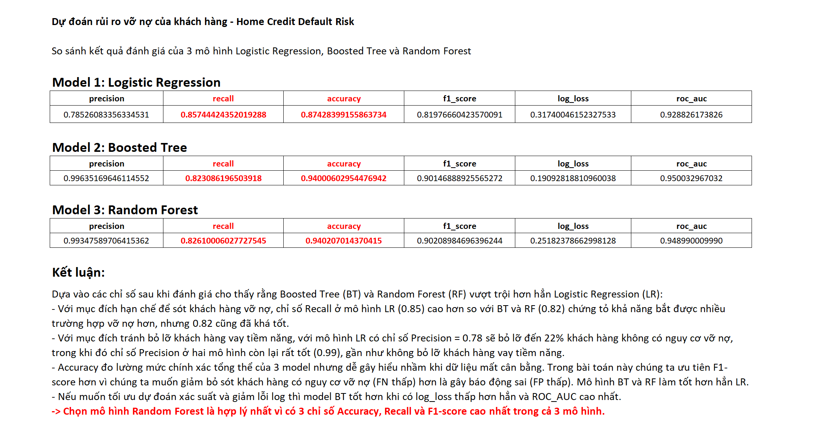

# Home Credit Default Risk Prediction
Python, SQL , Machine Learning

## 📌 Mô tả dự án
Dự án này nhằm dự đoán rủi ro vỡ nợ của khách hàng dựa trên dữ liệu từ cuộc thi **[Home Credit Default Risk](https://www.kaggle.com/c/home-credit-default-risk/data)** trên Kaggle. Mục tiêu là xây dựng mô hình machine learning có thể phân loại khách hàng có nguy cơ vỡ nợ hay không.

---

## 📁 Cấu trúc thư mục
homecredit_default_risk/ 

│── EDA_home_credit_default_risk.ipynb: Phân tích dữ liệu khám phá (EDA) và chọn tính năng để đưa vào huấn luyện mô hình

│── homecredit_default_risk_predict_result.ipynb: Kết quả dự đoán từ mô hình 

│── homecredit_default_risk_predict_result.csv: File kết quả dự đoán cuối cùng 

│── build_model_code/: Mã nguồn xây dựng mô hình 

│── compare_models_result.png: Hình ảnh so sánh mô hình 

│── README.md: Tài liệu mô tả dự án

---

## 🛠️ Công nghệ sử dụng  
- Python
- Big Query
- Pandas, NumPy  
- Scikit-Learn
- Matplotlib, Seaborn (Visualization)  

## 🔹 Dữ liệu sử dụng
Dữ liệu được lấy từ cuộc thi **Home Credit Default Risk** trên Kaggle. Bạn có thể tải về tại đây:  
🔗 **[Home Credit Default Risk Dataset](https://www.kaggle.com/c/home-credit-default-risk/data)**  

---

## 📊 Các bước thực hiện
1. **Phân tích dữ liệu (EDA)**  
   - File `EDA_home_credit_default_risk.ipynb` chứa phân tích dữ liệu và trực quan hóa.
  
2. **Xây dựng mô hình**  
   - Sử dụng các thuật toán như Logistic Regression, Boosted Tree và Random Forest để dự đoán.  
   - File `build_model_code/` chứa code huấn luyện mô hình tại Big Query.

3. **Đánh giá mô hình**  
   - So sánh hiệu suất các mô hình qua AUC-ROC, Confusion Matrix.  
   - File `compare_models_result.png` chứa hình ảnh kết quả.  

4. **Dự đoán rủi ro vỡ nợ**  
   - File `homecredit_default_risk_predict_result.csv` chứa dự đoán cuối cùng.  
   - File `homecredit_default_risk_predict_result.ipynb` kiểm tra kết quả dự đoán.  

---

## 📌 Kết quả mô hình
 **So sánh các mô hình:**  
    

👉 **Kết quả chi tiết được lưu trong file `compare_models_result.png`.**  

---

